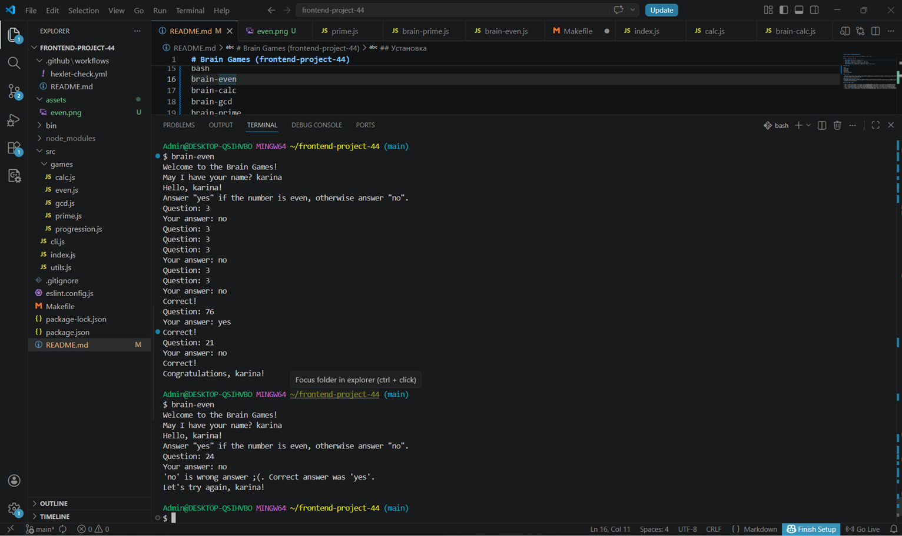
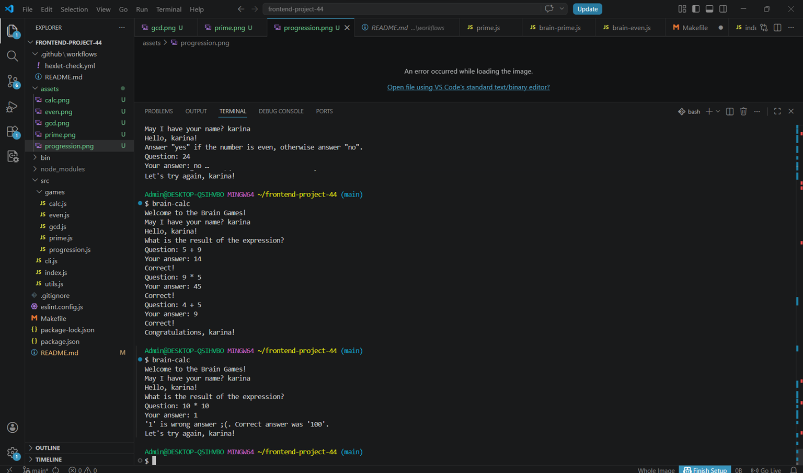
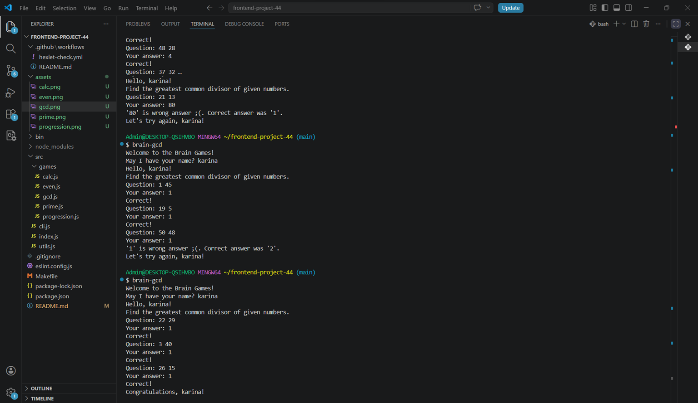
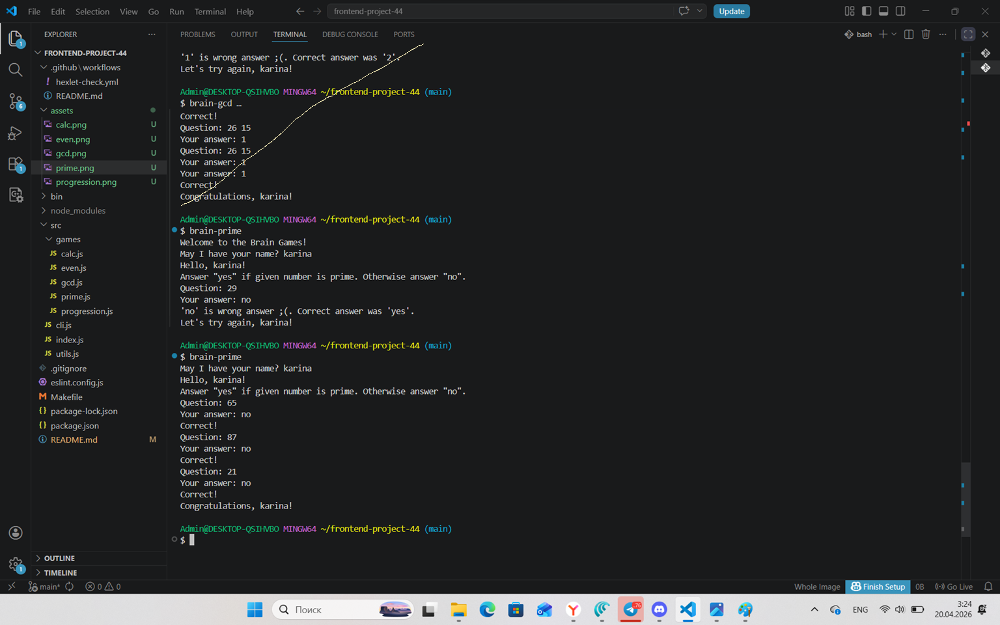
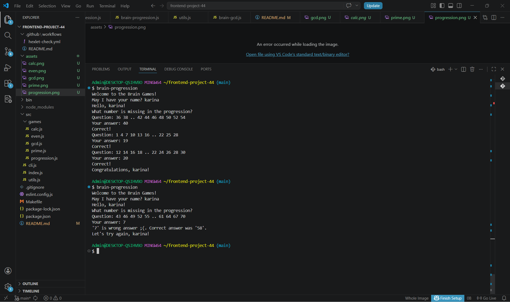

# Brain Games (frontend-project-44)

Текстовые консольные игры для проверки умения считать в уме. 

## Игры, входящие в проект:

- `brain-even` — проверяет чётное ли число  
- `brain-calc` — вычисляет выражения `+`, `-`, `*`  
- `brain-gcd` — наибольший общий делитель двух чисел  
- `brain-prime` — проверяет, является ли число простым  
- `brain-progression` — угадывает пропущенный элемент в прогрессии

## Установка

```bash
git clone https://github.com/jpkk8/frontend-project-44.git
cd frontend-project-44
npm install
npm link

## Запуск игр

```bash
brain-even
brain-calc
brain-gcd
brain-prime
brain-progression
```


## Проверка

[](https://sonarcloud.io/summary/new_code?id=jpkk8_frontend-project-44)

### Hexlet tests and linter status:

[](https://github.com/jpkk8/frontend-project-44/actions)

## Демонстрация работы

### brain-even


### brain-calc


### brain-gcd


### brain-prime


### brain-progression
